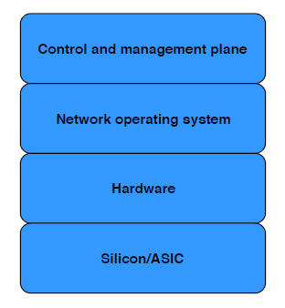

### 基础知识

#### 开放式交换机

通常，交换机可以表示为四个分层组件的堆栈，如下所示:



- 控制和管理平面应用程序为交换机用户提供特定功能
- 网络操作系统(NOS)控制硬件和底层ASIC以用于联网，并允许控制和管理平面应用程序使用硬件
- 硬件层包括交换机的其他所有物理组件，例如接口、输入/输出端口、LED和电源
- 芯片或ASIC(专用集成电路)是为特定任务而设计的专用硬件元件，对交换机来说，此任务是通过网络快速发送数据包

传统交换机交付时预安装了无法更改的软件，而开放式交换机解耦了NOS和底层硬件，可以彼此独立地改变，因此，开放式交换机让用户拥有更多的选择权去运行什么NOS。

#### 开源网络操作系统——SONiC

SONiC(Software for Open Networking in the Cloud)是微软基于`Debian Linux`打造的一款开源网络交换机操作系统(NOS)，其架构如下:


SONiC向上通过各种syncd组件对接各个应用，例如通过fpmsyncd对接BGP路由应用。目前SONiC支持的syncd组件有fpmsyncd转发平面控制、intfsyncd逻辑接口控制、neighsyncd邻居和下一跳信息管理、portsyncd物理端口控制、teamsyncd链路聚合组(LAG)控制等，不同组件操作数据库中逻辑上的不同数据表。整个SONiC数据库对外围的Orchestration Agent、SSWS Syncd、syncd组件与自己互通的接口进行了规定，称为Object Library。各组件与数据库的通信采用C/S模式，并且支持发布订阅机制。

##### DATABASE容器

- APPL_DB: 存储交换机状态信息
- CONFIG_DB: 存储控制和管理平面创建的配置信息
- ASIC_DB: 存储基于SAI描述的交换机状态信息
- COUNTERS_DB: 存储交换机端口关联的统计信息

##### SYNCD容器

同步容器的目标是提供一种机制，对交换机的网络状态与交换机的实际硬件/ASIC状态进行同步，即网络操作系统和硬件层面的同步，其核心组件如下:

- syncd: 负责执行同步逻辑，通过订阅`ASIC_DB`响应交换机的网络状态变化，并调用SAI API将状态变化同步到实际硬件/ASIC，同时将实际硬件/ASIC的状态反向同步到`ASIC_DB`，保持状态的一致性
- SAI(Switch Abstraction Interface) API: 交换机抽象接口是一个跨平台的交换机平台接口，向上给SONiC提供了一套统一的控制接口，向下则对接不同供应商的ASIC，更换底层硬件无需修改上层应用
- ASIC SDK: 硬件供应商应ASIC驱动基于SAI的封装

##### SWSS容器

交换状态服务(Switch State Service)容器，负责所有SONiC模块之间的通信，模块之间通过DB进行交互

- Portsyncd: 监听与端口相关的NETLINK事件(速度、MTU)，将收集到的状态写入`APPL_DB`
- Intfsyncd: 监听与接口相关的NETLINK事件(新增/修改IP地址)，将收集到的状态写入`APPL_DB`
- Neighsyncd: 监听与邻居相关的NETLINK事件(ARP)，将收集到的状态写入`APPL_DB`

上面就是交换机状态信息的生产者，下面来介绍下交换机状态的消费者

- Orchagent: 负责将`<功能>syncd`收集到的状态信息从`APPL_DB`翻译到`ASIC_DB`
- IntrMgrd: 监听`CONFIG_DB`、`APPL_DB`、`STATE_DB`相关接口表的变化，并对接口进行配置(只有监听的所有数据库的状态一致没有冲突时才执行配置)
- VlanMgrd: 监听`CONFIG_DB`、`APPL_DB`、`STATE_DB`相关VLAN表的变化，并对VLAN进行配置(只有监听的所有数据库的状态一致没有冲突时才执行配置)

`<功能>syncd`是交换机状态的生产者，负责收集交换机相关功能的状态信息，并写入`APPL_DB`对应功能的表中
`<功能>Mgrd`是交换机状态的消费者，负责监听`CONFIG_DB`、`APPL_DB`、`STATE_DB`对应功能表的变化，并执行相关功能进行配置

#### 总结

想知道设置完`CONFIG_DB`对应表后SONiC如何处理，找到对应的`Mgrd`实现即可

### GNMI Server设计和开发

#### 设计概述

SONiC交换机通过`show`命令查询交换机信息，通过`config`命令对交换机进行配置，而GNMI Server的核心功能只是将SONiC交换机的`show`命令和`config`命令以gNMI(`gRPC Network Management Interface`)的方式暴露出来。

gNMI有点类似WEB请求，一个路径映射一个处理，我们使用YANG模型来描述请求参数，为了支持跨语言，我们使用根据YANG模型生成的Proto文件对请求参数进行解析。现阶段为了减少工作量和歧义，并没有直接使用OpenConfig的YANG模型来描述交换机信息，而是根据SONiC交换机使用的数据库表结构来定义私有的YANG模型，这样在SONiC这一侧，就可以省去YANG模型到SONiC模型的翻译过程了，只需在Mars侧，将我们定义的私有YANG模型翻译成ONOS对应的交换机元素即可。

#### 开发流程

Mars侧在与SONiC交换机建立联系后，会获取交换机描述信息，包括平台信息和端口信息，下面以端口为例，来描述下开发流程

##### 确定端口的YANG模型

> 确定对应的show命令

```
### 端口基础信息查询
$ show interface status
### 端口统计信息查询
$ show interface counters 
```

通过阅读[sonic-utilities](https://github.com/Azure/sonic-utilities)的`show`目录`main.py`文件中对`show interface status`和`show interface counters`的处理，我们就能知道端口信息是从哪个数据库的哪张表获取的，或者是通过什么命令执行获取的（如果数据能从数据库获取，则GNMI Server实现时尽量从数据库获取，避免解析命令行执行结果花费太多时间，毕竟Mars的查询频率很高），这边我们知道是`APPL_DB`的`PORT_TABLE`表，相关[表名宏定义](https://github.com/Azure/sonic-swss-common/blob/master/common/schema.h)

> 确定对应的config命令

```
# config interface speed
# config interface startup
# config interface mtu
# config interface description
```

通过阅读[sonic-utilities](https://github.com/Azure/sonic-utilities)的`config`目录`main.py`文件对`config interface speed`等命令的处理，我们就能知道端口配置是设置数据库的哪张表的哪个字段（如果配置只涉及数据库操作，而不需要执行额外命令行，则GNMI Server实现时可直接操作数据库，否则尽量直接调用SONiC命令行来实现相应逻辑，配置不会很频繁直接调用命令可以减少编程复杂度），这边我们知道是`CONFIG_DB`的`PORT`表，相关[表名宏定义](https://github.com/Azure/sonic-swss-common/blob/master/common/schema.h)

> YANG模型编写准则

```
module sonic-port {

  yang-version 1.1;

  namespace "http://github.com/Azure/sonic-port";
  prefix port;
  
  description "PORT yang Module for SONiC OS";

  revision 2020-01-20 {
    description "First Revision";
  }
  
  container sonic-port {

    container port {
        list port-list {
        
            key "port-name";
            
            leaf admin-status {
                type stypes:admin-status;
            }
            
            container state {
                leaf oper-status {
                    type stypes:oper-status;
                }
            }
        }
        
        list port-statistics-list {
            key "port-name";
        }
    }
}
```

- `module sonic-port`表示此YANG文件描述的是端口
- `container sonic-port`表示下面都是端口的相关表，每张表对应一个`container`
- `container port`表示`CONFIG_DB`的`PORT`表的描述信息(表名小写)
- `list port-list`表示`CONFIG_DB`的`PORT`表的表项信息(表名小写 + list)
- `CONFIG_DB`的`PORT`表的所有字段必须出现在`list port-list`中
- `APPL_DB`的`PORT_TABLE`表比`CONFIG_DB`的`PORT`表多出的字段放入`container state`中
- 端口统计信息比较特殊，它来自`COUNTERS_DB`，没有表名，不遵循上述规则，使用虚拟表`port-statistics`代替
- 其他细则参考[官方文档](https://github.com/Azure/SONiC/blob/master/doc/mgmt/SONiC_YANG_Model_Guidelines.md)

GNMI Server使用的YANG模型参考[sonicpb](https://github.com/TeamNocsys/sonicpb)

> 注意后面不管是GNMI Server侧还是Mars侧开发，其最底层的核心接口，都是围绕单个`list port-list`对象进行处理

##### GNMI Server侧开发

> 实现单个Port对象的查询和设置

在`pkg/gnmi/cmd`目录下创建`port.go`文件，实现单个PORT的查询和配置，即对`sonicpb.SonicPort_Port_PortList`的处理(对应PORT的YANG模型中的`list port-list`)，可以看做`show interface`和`config interface`的Python版本对应的GO版本实现

> 暴露查询接口

首先添加处理句柄，在`pkg/gnmi/handler/get`目录创建`port.go`文件，新增端口处理句柄`func PortHandler(ctx context.Context, r *gnmi.GetRequest, db command.Client) (*gnmi.GetResponse, error)`，所有GET请求的参数列表相同。从gNMI请求的XPATH中提取关键字，判断是获取单个端口信息还是获取所有端口信息，从`CONFIG_DB`的对应`PORT`表查询出所需的KEY值列表，遍历列表，并调用上面单PORT对象的查询接口获取对应端口信息。

然后在`pkg/gnmi/handler/get`的`route.go`文件中添加一条路由(有点类似WEB)，其中XPATH根据`sonic-port.yang`文件生成，格式类似`/{container名称}/{container名称}/{list名称}`，或者直接使用yang文件生成的[sonic_port.proto](https://github.com/TeamNocsys/sonicpb/blob/master/api/protobuf/sonic/sonic_port.proto)文件中对应`PortListKey`的`yext.schemapath`

> 暴露设置接口

首先添加处理句柄

- 删除

在`pkg/gnmi/handler/set/delete`目录创建`port.go`文件，从gNMI请求的XPATH中提取关键字(YANG模型中定义的`key`名称)，然后调用上面单PORT对象的删除接口

- 添加

在`pkg/gnmi/handler/set/update`目录创建`port.go`文件，从gNMI请求的XPATH中提取关键字字(YANG模型中定义的`key`名称)，然后调用上面单PORT对象的设置接口

##### Mars侧开发

Mars侧首先要解决YANG模型和ONOS模型的映射，即我们要实现相应的适配器类，作为Mars和SONiC的中间层(`com.nocsys.drivers.nocsys.gnmi.adapter.port`)

> 添加YANG模型到ONOS模型的映射

这个是用来实现GET请求的处理，通过为适配器实现一系列`get`方法，将YANG模型的属性暴露给Mars。

在这里我们为`port`添加`Decoder`类，其内部保存了GET请求返回的端口列表(PortListKey对象列表)，我们使用`Map`来保存，`Map`的关键字和SONiC的`PORT`表KEY保持一致。首先我们要实现一个`parse`方法，将GET请求返回的YANG模型保存起来。然后如果我们想暴露端口的管理状态属性，那么我们可以实现一个`getAdminStatus`函数，返回`PortListKey`对象的管理状态属性值。最后我们还可以实现一个`build`接口，将YANG模型转换为ONOS模型，例如将其转换为`PortDescription`对象。

> 添加ONOS模型到YANG模型的映射

这个是用来实现SET请求的处理，通过为适配器实现一系列`set`方法，辅助Mars来修改YANG模型的属性。

在这里我们为`port`添加`Encoder`类，其内部保存了需要设置的端口列表(PortList.Builder)列表。如果我们想设置端口的管理状态，我们可以实现一个`setAdminStatus`函数来操作对应的YANG模型，对Mars屏蔽底层细节。最后我们需要实现一个`build`方法，将YANG模型序列化成字节流，用于gNMI传输。

> 适配器类应用

- 参考`GnmiDeviceDescriptionDiscovery.java`的`discoverPortDetails`学习`Decoder`类的使用
- 参考`NocsysPortAdminImpl.java`的`enable`学习`Encoder`类的使用

> 删除操作

删除操作通过在XPATH中添加需要删除对的YANG模型关键字来实现删除指定对象，例如`/sonic-port/port/port-list[port=Ethernet11]`，不需要适配器类的支持

#### 参考

[官方文档](https://github.com/Azure/SONiC/wiki/Architecture#switch-data-service-database-schema)